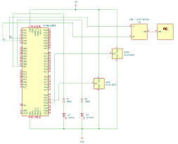
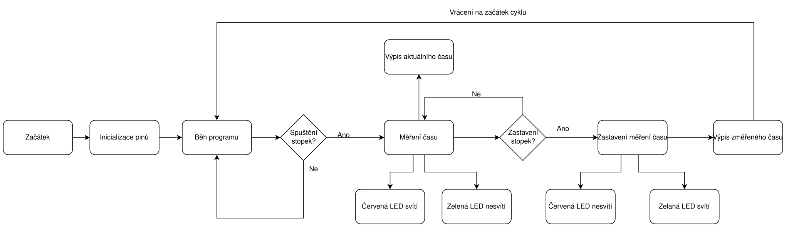
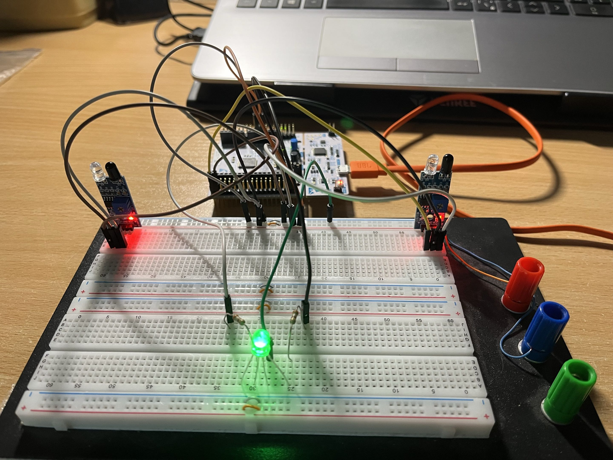

Stopky s infračevenými senzory
===========================

Účel/Zadání/Funkce
-----------------------
Vytvořte program, který pomocí timeru vykonává funkci stopek za pomocí dvou infračervených senzorů

Navrhněte a nastavte kanál timeru TIM3 pro 1 ms (tedy 1 kHz).
Povolte rutinu přerušení a v rutině přerušení vytvořte proměnnou čas.
Prvím senzorem stopky spouštějte stopky.
Při spuštění stopek přes UART vypište zprávu (pouze jednou) ,, Váš čas byl odstartován".
Jak stopky budou spuštěné, přes UART vypisujte aktuální čas stopek ve formátu 1,234s.
Druhým senzorem stopky zastavte a přes UART vypište zprávu (opět pouze jednou) o změřeném čase ve formátu 1,234 s.
Zajistěte funkci stopek tak, aby nové měření bylo spuštěno opětovným pohybem předmětu před prvním senzorem.
Do projektu ještě přidejte 2 LED diody a v programu to udělejte tak, aby první signalizovala jestli stopky jsou aktivní(červená)a druhá signalizovala, že nejsou aktivní a jsou připravené pro měření(zelená).

Schéma zapojení
-----------------------

Popis funkce kódu
-----------------------
Celý kód je okomentovaný v main.c a stm8_it.c, zde je stručný popis funkce kódu.
1. Timer je nastavený na 1 ms a každou 1 ms skáče do rutiny přerušení.
2. V rutině přerušení je podmínka, která povoluje inkrementaci globální proměnné čas
3. Když mávneme třeba rukou před prvním snímačem, tak se splní podmínka v mainu, která v rutině přerušení povolí inkrementaci proměnné čas
4. V pruběhu zvyšování proměnné se její hodnota vypisuje, v mainu je výpočet na převod, aby to vypisovalo sekundy a milisekundy
5. Pokud mávneme třeba rukou před druhým snímačem, tak podmínka v mainu zastaví v rutině přerušení timeru inkrementaci proměnné čas a výsledný změřený čas se vypíše do terminálu
6. V mainu v podmínkách pro senzory jsou ještě kódy pro LED diody, aby svítily jak vyžaduje zadání

Vývojový diagram kódu
-----------------------

Funkční zapojení
-----------------------
Zapojeno na nepájivém poli, místo dvou LED diod (zelené a červené) je v zapojení RGB LED dioda

Zhodnocení
-----------------------
Projekt jsem si vymyslel sám a také ho sám naprogramoval.V závěrečném projektu jsem si zopakoval TIMER, UART, rutinu přerušení timeru a reakci na nástupnou a sestupnou hranu. Neměl jsem nějaké výrazné potíže, jediné co mi dělalo problém byl výpis aktuálního času při spuštění stopek, tak jak jsem chtěl. Zjistil jsem si, že do printu pro výpis aktuálního času můžu přidat \r, což udělá to, že výpis je na jednom řádku, tak jak jsem chtěl. Ještě jsem si zjistil, jak správně spočítat převod času na milisekundy. Myslím si, že zjištění těchto dvou věcí je drobnost, a tak svůj závěrečný projekt do mikroprocesorové techniky bych ohodnotil známkou 1.
